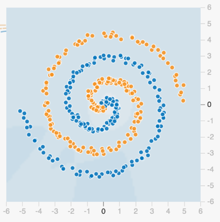
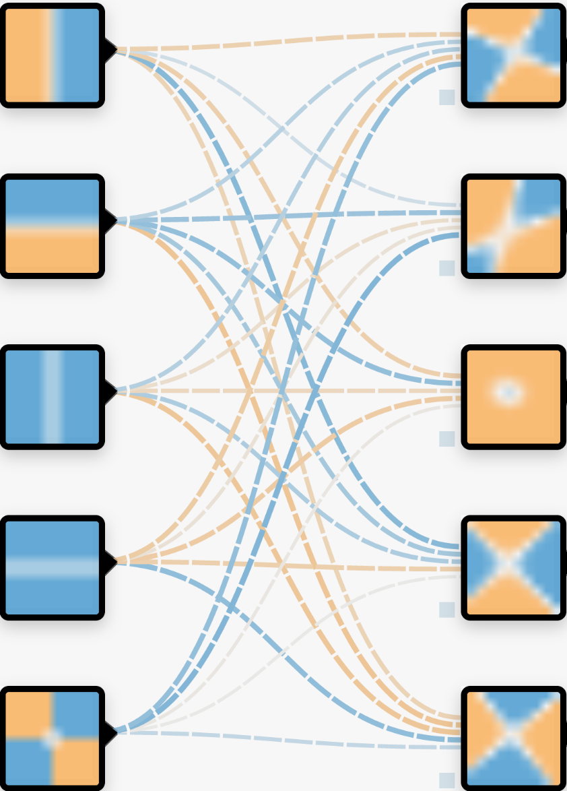
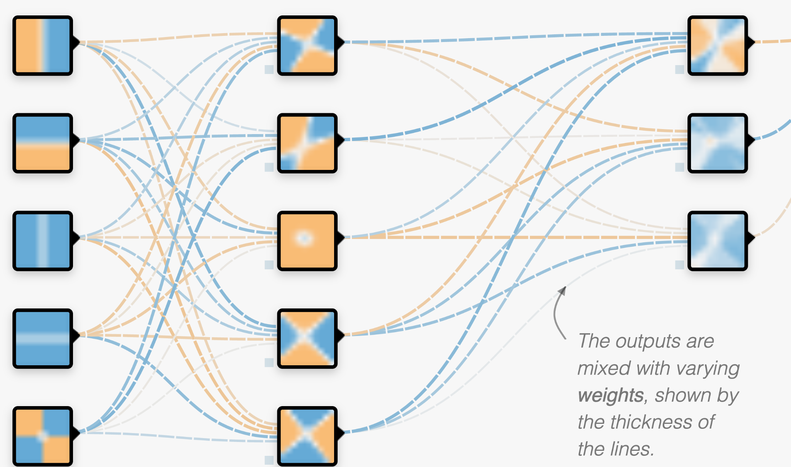
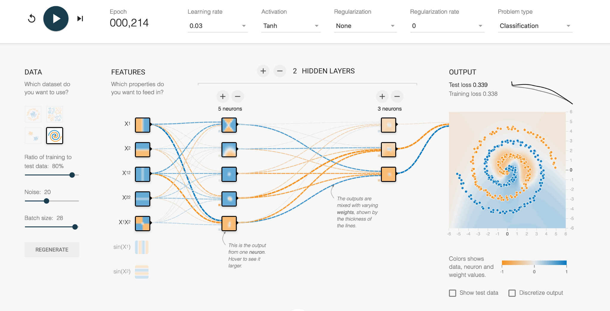
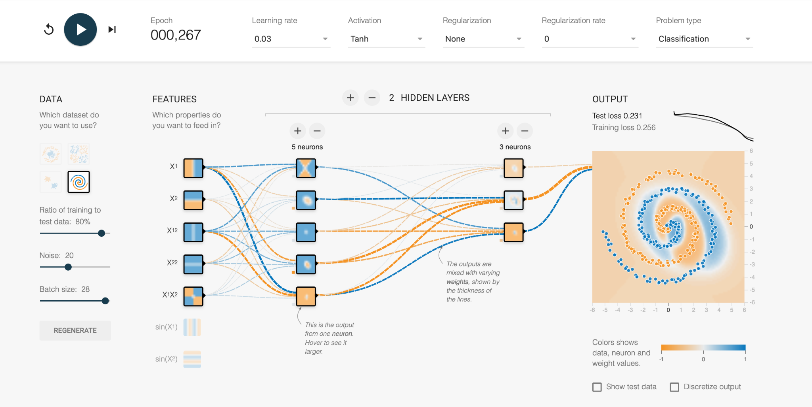
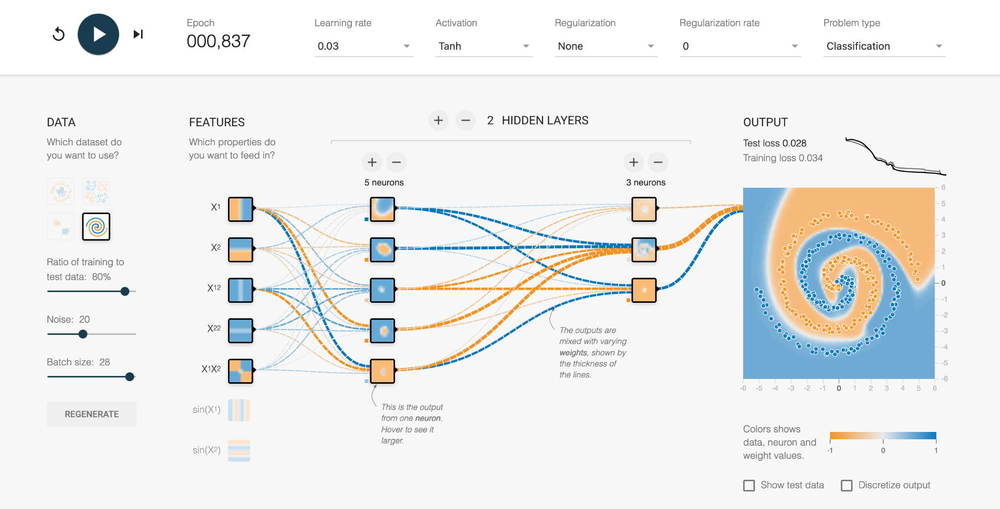

# Using AI in Research: Insight

We previously discussed using AI in tools for automating data such as data collection and classification. However, AI can also be used to give insights into data that is not posisble for humans. 

Breakthroughs using AI in research are commonly discussed but should be considered with scepticism and a critical approach. In general, however, the ability for computers to process and analysis connections on a larger scale means it is possible for AI to find results. 

We will discuss a range of examples. 

## Clustering: Letting the Machine Classify Data

Up until this point, we have looked at examples where humans have classified the data (handwritten digits, whether something counts as a cell, the difference between a duck and a goose) but a group of machine learning techniques called "unsupervised machine learning" does not use human labels but finds its own. 

For example, by providing huge data sets and the connections between them, for example the "multiomics" of millions of cells, the machine can determine clusters within the data and how groups may be similar and disparate to each other. For this reason, machine learning classifications can provide insight into a dataset that would not be possible through human manual effort. 

Using this kind of machine learning does not require a labelled data set, instead, the machine is allowed to find clusters using given parameters, such as how many it should find or how distinct groups need to be. 

> Xiao, Yi, et al. "Multi-omics profiling reveals distinct microenvironment characterization and suggests immune escape mechanisms of triple-negative breast cancer." Clinical cancer research 25.16 (2019): 5002-5014.

## Principal Component Analysis: When you have too many dimensions

Increasingly, with large datasets that cover the multiple -omics or collect hundreds or thousands of variables from biological specimens, it can be impossible to see the connections and interactions between them. Machine learning can help by collapsing down the complexity into manageable (but artifical) variables that sufficiently describe the data. 

In principal component analysis, you could take some measurements of fish such as their length and height. By combining the data from hundreds of fish, you can use PCA to determine two new variables, which account for most of the variation in your dataset. The first is the scale of the fish (large vs small) and then the aspect ratio or "stubbyness" of the fish (stubby vs slender). You can use these two new variables, scale and stubbyness to describe the full variation in your data set, and so separate out your fish into:

- Stubby and large
- Stubby and small
- Slender and large
- Slender and small

> Favela, Luis. (2021). The Dynamical Renaissance in Neuroscience. Synthese. 10.1007/s11229-020-02874-y. 

Which is far more meaningful for understanding the morphology than separating out fish into bins of height and length values.

This example is simplistic because the data set only has two variables, but for data sets with hundreds of variables it can be very difficult to determine which variables are the most critical for understanding the diversity within your specimens. The combination of your variables into a principal component captures all the variation in your dataset.

## Neural Networks: the black box

Neural networks can be used to infer predictions from data by learning from known examples. They are an example of "supervised machine learning", unlike the previous examples, which means a large training dataset of labelled data is required before any predictions can be made. 

If you have the a lot of different markers from one group of people who are known to have a disease and from another group of people without the disease, you can ask the machine to guess on a new series of people which group they may belong to. Or, you could build a neural network that learns the drug interaction effects on people with certain microbiome populations.

> ### Case Study: Alpha Fold
>
>
>
> Alpha Fold is a famous example of an extremely complex neural network approach to solving protein folding. It is not fully known how Alpha Fold works, but the gist is familiar, which is teaching itself how molecules interact with eachother by using a very large training dataset of known proteins. 
>
> Solving protein folding has been a hotly contested task. The predictive powers of machines in protein folding has not shown much improvement with less than 50% matching power in 1994, which improved to around 60% in the last decade. Alpha Fold was a game changer, with results of 90% last year. 
>
> {: .callout}

### How Neural Networks Work

How the machine makes these predictions is not very easy to unpick, which is why these methods are known as black box. We can therefore use a toy example from [TensorFlow Playground](https://playground.tensorflow.org/) to understand how they work. 

---

With a very difficult dataset it can be impossible to know the "rules" behind what separates orange from blue. 

---

We start with a series of "properties", or regions that could be used to classify the data. It is clear each of the following properties (regions) is not sufficient to classify our dataset. 

---

We can combine these regions together to make a new "layer". The "neurons" in the neural network are combinations of the properties with varying weights (thickness of the lines). The model hasn't learnt anything yet, and so the regions in this layer are currently randomised. 

---

There is usually further layers which combine each of these with different weights as well. The number of these neurons can be vast, which is why it is difficult to know what is happening within the layers of the network or how they are defined.

---

Then, using the labelled training data set, the neural network rapidly alters the weights throughout the network to redefine itself. After it adjusts the weights it checks how well it is doing at classifying the data set, and adjusts itself accordingly to try and improve. Depending on the complexity of the take, this could take many hours or thousands of hours of computing. 

Luckily, this toy example only takes a few seconds, so we can watch its progress.

In the first increment, we see the vague blue and orange background as the network tries out its initial configurations. This is a start, where the middle of the data set is classified correctly, but the error is a high number (Test loss = 0.339 out of 1). 

---

With further refinement, we can see the weights between the neurons are changed through trial and error, and the orange and blue regions more closely fit the actual data. The numerous mistakes mean the error is still high.

---

Eventually the network learns the complex boundary definitions of the two data types and produces a solution (Test loss = 0.028). We can look at each of the neurons and see what region it is personally responsible for, and whether it is -1 or +1 in the final combined solution. 

---

It's not usually this simple to "take a look" at the inner workings of a neural network, which is why a lot of scepticism and caution is required for using them, as discussed in the next episode. 

## Conclusions

Very large, multiconnected data sets can be too complex for humans to manually find insight, and so AI can step in and assist in more and more ways. Some methods are easier to understand and query than others, but using AI to assist human analysis is becoming a helpful tool in research.  


