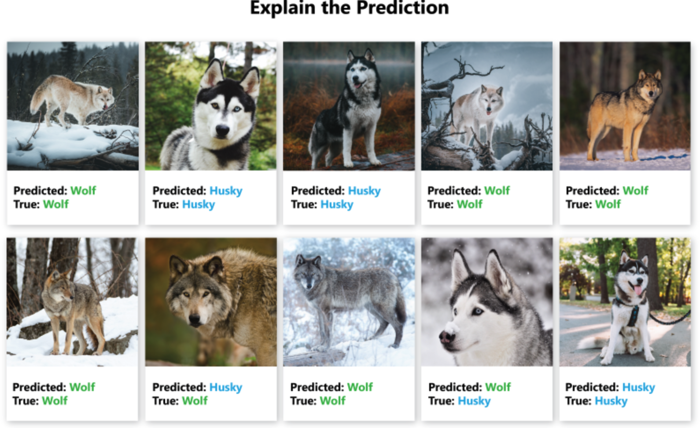
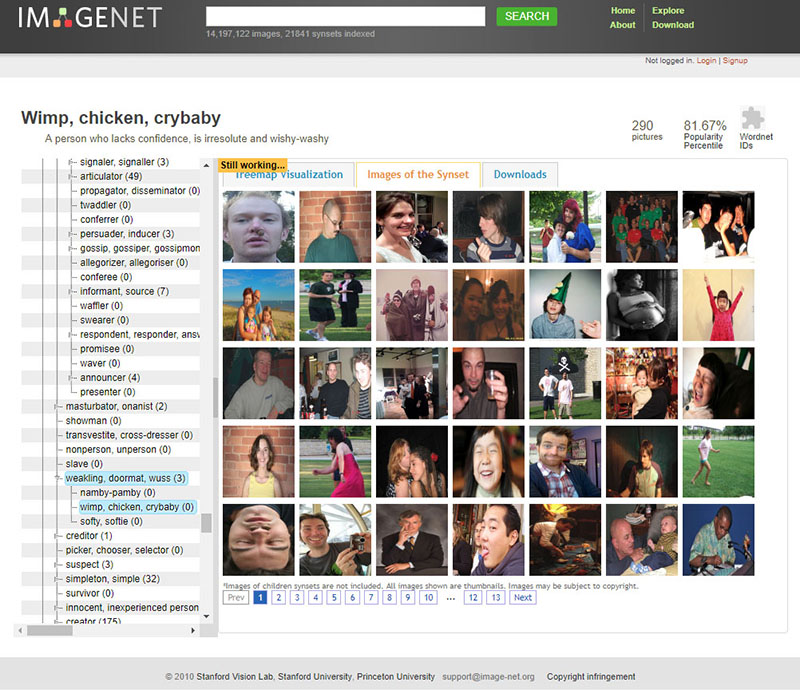
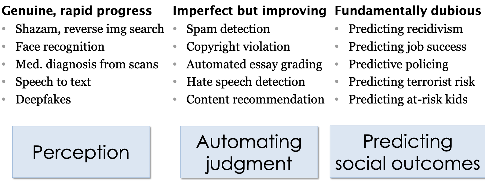

FIXME



# Problems with AI

## When the Machine Learns Something Unexpected

The neural network used to distinguish wolves and huskies seen below got 8/10 of the following correct. The two mistakes are on the bottom row, the 2nd and 4th from the left. 

We can't easily see the neural network layers that explain how the model is distinguishing between wolves and huskies. However, for image data we can use a pixel attribution method to highlight the pixels that were relevant for a certain image classification by a neural network. Here is another example of a husky falsely classified as a wolf by the neural network. 

We can see the neural network is not using any of the pixels related to the canine, but instead looking at the background for the presence of snow in order to classify it as a wolf. 

In the same way, the model may instead use unexpected and inappropriate signals in the data to provide an answer. A real life example of this happened with a recent machine learning model used to distinguish cases of covid that were clinically severe versus moderate from x-rays, In the training data, the covid patients who were most severe were lying down during their chest x-rays, and so the model learnt to distinguish x-rays of people lying down. 

## Biased Data Leads to Biased Algorithms

Machine learning bias, also sometimes called algorithm bias or AI bias, is a phenomenon that occurs when an algorithm produces results that are systemically prejudiced due to erroneous assumptions in the machine learning process.

## Where Does the Data Come From?

Data is not a natural resource, but the product of human decisions. Whether we are conscious of it or not, there is always a human-in-the-loop when we speak about data creation. Data creation can be, for instance, collecting information or the tracking of historical information, organising information in specific categories, measuring and storing information as data on digital infrastructure. 

When we find a data collection enriched with metadata information or specific labels, we always need to remember that someone has either directly provided those labels or those have been automatically assigned by a tool trained on other manual labels. 

To give a specific example, the famous ImageNet dataset, central component for the development of many well known image recognition pipelines in the last ten years, relies on two pillars: - a taxonomy developed since 1985 as part of the lexical database WordNet, which provides a top-down hierarchical structure of concepts ("chair" is under Artifact->furnishing->furniture->seat->chair) - an enormous amount of cheap workforce provided by Amazon Mechanical Turk. ImageNet is not an abstract resource, but the result of a gigantic effort and the specific representation of the World of *1)* the people who have designed WordNet, *2)* the researchers who have decided which WordNet categories are included and which are not in ImageNet and *3)* the many, many annotators who have selected which images associate to concepts like "brother", "boss", "debtor", "cry baby", "drug-addict" and "call girl", all included both in WordNet and ImageNet (at least until 2019).

As researchers collecting data that can go onto train machine learning models, there can be similar pitfalls. Labelling data sets can be open to human bias, where two people may differ on how to label a set of examples. In addition, even without human bias there can be artifacts form how data was collected. In training a machine learning model to differentiate cancer tissue from normal tissue, if the cancer samples were all photographed from a lab in Germany and the controls were taken from a lab in Birmingham, the model may simply pick up differences in lighting and microscopes between the different data sets. It is therefore critical to consider the data that AI is using to train and where it came from. 

## Snake Oil: AI is not Magic

Professor Narayanan described how companies are using AI to hire candidates based on just a 30-second video. They dish out a blueprint with scores based on different aspects such as speech patterns that have been grasped from that video. These scores are then used to decide whether that candidate is a suitable hire or not.

Given enough data, a machine learning model can improve and be made reliable. However, in the case of ethical, social dilemmas such as public policing or criminal prediction, anomalies emerge and can prove fatal.

Princeton’s Narayanan outlines the difference between AI innovations we can trust versus those we can't:

In the above cases, which are fundamentally dubious, as the professor likes to call them, the ethical concerns will be amplified with inaccuracies in model output.

In research we are vulnerable to similar unfounded claims from machine learning, whether for describing new results or even applications to medical care. Approaching the results of machine learning with scepticism is important. 

Read more: https://www.cs.princeton.edu/~arvindn/talks/MIT-STS-AI-snakeoil.pdf

## Overfitting: Too Good to be Useful

A good machine learning model generalises well to data beyond its training data. When given data it has never encountered before, it creates sensible outputs. It is tempting to train a model so the error margins on the training data are minimal, but this leads to overfitting issues that we see in other statistical models. One way to avoid overfitting is to never validate a model using data from the training data set, and to allow for some error in the model. 

