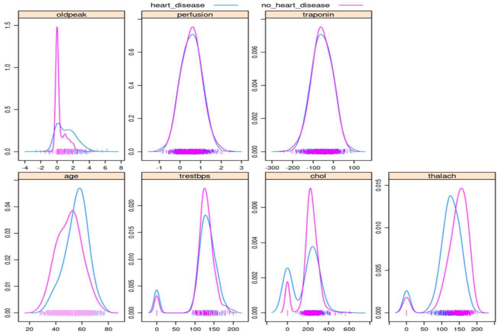

# Practical considerations of conducting research with machine learning algorithms

Whether you are conducting your own research with machine learning (ML) algorithms, or reading about other work that has used them, there are some helpful ideas that can help you understand what work you might be undertaking or how to correctly interpret others' research. This chapter aims to provide an overview of what is expected when such research and how results should be reported.

### Data preparation is 90% of the work

If you are going to be building ML pipelines for your own research, then you should know that the vast majority of your time will be spent analyzing your datasets and preparing them for the (usually) few lines of code that will run your ML algorithm. So why is so much time often spent on data preparation? 

##### You might be dealing with complex data structures

Depending on your research area, you will be in receipt of data that has been collected and curated in numerous different ways. If you work with data collected in a hospital setting, perhaps within one clinic you can expect to be working with excel spreadsheets fraught with multiple tables per spreadsheet, numbers interpreted as dates, and ad-hoc notes in random cells. Perhaps you might be more fortunate to work with a .csv file that contains one table per file. If you are working with more centralized data you will likely be working with relational databases that require you to merge tables together and aggregate them, usually with a database query language such as [SQL](https://www.w3schools.com/sql/). 


If you are working with genetic data then you will have come across terms such as FASTQ, FASTA, BAM, SAM and VCF. These are all specialized forms of plain text files that contain various representations of genetic sequence data. 


|  | 
|:--:| 
|A FASTA file to contain nucleotide sequences. For whole genome sequencing expect millions of lines in such a file - the FASTA file for the human reference genome is ~ 3Gb in size. |

|  | 
|:--:| 
|A Variant Call Format (VCF) File. All but the last 5 lines contain metadata about the file, and the "data" are only contained in the last 5 lines. |

It is probably not surprising that many of these file types are not directly usable with an ML algorithm, and code must be written to *parse* them into a format that can. We haven't even touched on the fact that image and unstructured text (e.g., in natural language processing) are often sources of data for ML pipelines. How would you send the words you are reading right now into an ML algorithm to decide if the source is fact or fiction? How do you parse image data, a grid of pixels split into Red, Green and Blue channels into a .csv like structure?

|  |
|:--:|
|Image data can be represented in various forms. Here the image is represented by three matrices: Red, Green and Blue, shown in the middle. Entries represent the intensities of pixels; Those matrices can be flatten and reshaped into an image vector. |

##### Data quality can be poor

Biomedical data is almost never collected for AI/ML algorithms, and most of the time not even for research. Most primary and secondary care is collected at point of care, and certain clinical codes (prescriptions) have monetary incentives for collection, but other (symptom tracking) do not. Lab tests are only reported to provide care to patients. Even if downstream research is kept in mind during data collection, are data standards in place such as data dictionaries that multiple sites can follow? 

The variable nature of data quality mainly falls into two categories: *systematic* and *random* error. 

Systematic errors are the weakness of oversight in methodological design or execution. Examples might include: 

- Research units submitting genetic data to a consortium might be using different sequencers or reference genomes. How do we harmonize the inherent differences in output data that will arise?

- There are a disproportionate amount of a certain group of people in a cohort study. If we are predicting risk of an event in the population, how might this skew our results and how do we correct for this?

- Missing data or incongruous data being collected due to poorly set out guidelines for field staff.

- HbA1c is commonly reported on two different scales (m/mmol and %) that share a very similar value distribution. What if one field researchers are using different scales? This is incredibly difficult (likely impossible to disentangle).


Random errors are those that occur due to chance and usually cannot be accounted for at the point of collection, but only through correction or "cleaning" after that data has been collected. Human error in data collection is the most easily understood source of random error, but also medical equipment, sequencers, image software all have some source of random error. Examples of random error might include:

- Clinicians might enter an incorrect prescription date or blood pressure value. Could we using a limit of normality to detect infeasible blood pressure values in a patient record? The author writing this chapter has worked with primary care databases that accidentally replaced the BMI column with today's date i.e. a BMI of 20222104!

- Patient identifiers such as NHS number are incorrectly entered and therefore "sharing" medical events with someone else in error. This can result in people appearing to have died and then pick up their hayfever prescription a month later, or people assigned as male on their birth certificate going on to give birth multiple times.

- A clinician mistypes the word "epilepsy" as "eplispey". Can ML algorithms deal with misspellings to determine people who are suffering from epilepsy?

### Fantastic errors and where to find them

Between dealing with complex data and the errors that they might contain you will need to ensure that as much error has been removed as possible and you harmonize your data into a "final" dataset that can be passed to an ML algorithm. The saying "garbage in, garbage out" is exactly the situation we are trying to avoid when we send data into an ML algorithm. Exploratory Data Analysis (EDA) largely accounts for a type of (usually automated) analysis to pick up errors in your data. For example, a quick visualization of data, using one line of code from a cardiology clinic shows that some people have cholesterol values of zero:

```r
featurePlot(x=data[1:7,], y=disease_status, plot="density")
```
 |
|:--:| 
|Can you spot the bimodal peaks in the "chol" and "trestbps" features? These zero values likely indicate these data weren't collected or not entered and leaving the values as zero can greatly skew the results of any analysis, including training an ML algorithm |

A simple density plot like the one above can be very effective at quickly spotting discrepancies, including values that are extreme such as 0 or a blood pressure of 999. It should be stressed though that these types of errors are quite easy to detect and are usually found during a first pass of the data. Some of the previous sources of error we have discussed can be far more difficult to spot - the example of incorrect input of an NHS number is particularly nasty given that the data doesn't look extreme unless you are looking for people that have died and then seemingly come back to life. The only way to discover issues with your data is to spend time querying it and trying to anticipate what might arise. Over time you will want to develop unit tests that automatically test for such errors in your data, and this is where a lot of the time is spent in the data preparation phase.

### Dealing with missing data
...


## Exercises
- What are the kinds of raw data in your research and how do they need to be prepared for ML Applications?
- Which steps in the presented data preparation workflow can you apply to your research?


