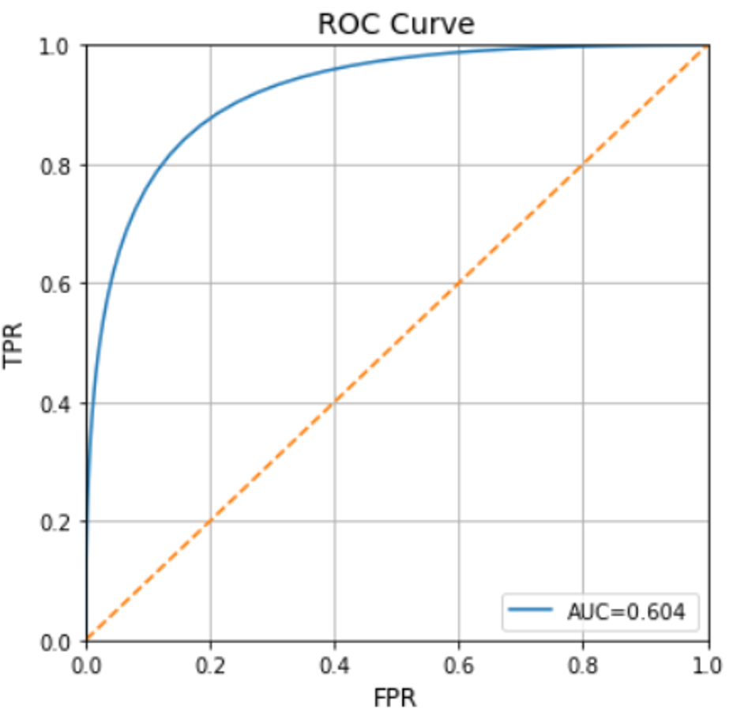
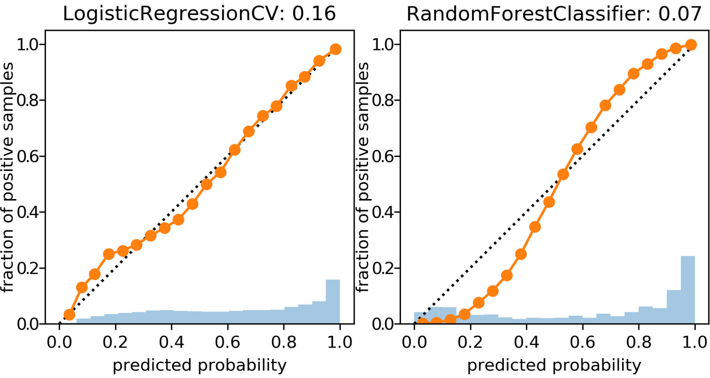
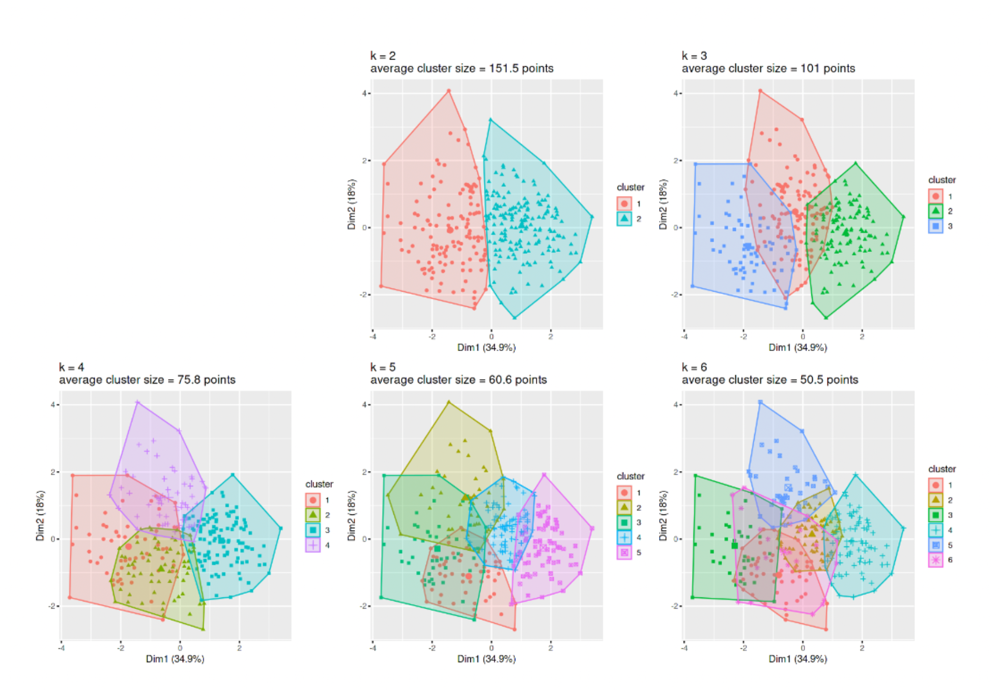

### Reporting results from machine learning pipelines

As with any other statistical analysis you can expect to report various metrics that communicate your results obtained from a machine learning (ML) pipeline. You may have heard of p-values, adjusted R-squared and the t-statistic used in methods such as a t-test or chi-squared-test. Supervised and unsupervised ML algorithms have their own metrics that you will be reporting:

* Supervised algorithms:
    - Accuracy
    - Sensitivity
    - Specificity
    - Precision
    - Recall
    - F1 score
    - Mean Squared Error (MSE)
    - Root Mean Squared Error (RMSE)
    - Mean Absolute Error (MAE)
* Unsupervised algorithms
    - Total within sum of squared error
    - Gap statistic
    - Silhouette value
    - Akaike Information Criterion

#### Reporting results in supervised analysis

Supervised learning can be divided into two types of problems: regression and classification. Regression is used for the prediction of continuous variables, and classification aims to classify something into specific categories, and often into just two categories (binary). Here, we mainly focus on the classification task. 

When training a supervised algorithm we can compare its predictions to the *ground truth* and therefore say if it is correct or incorrect. These leads to the first staple of reporting in supervised learning: **the confusion matrix**.

##### The Confusion matrix

For N number of classes (e.g., N=2 for predicting cancer vs no cancer), a confusion matrix is an NxN matrix that records how many the algorithm classified correctly and incorrectly by visualizing the actual classes against the predicted classes.

However many classes there are, a confusion matrix reports 4 types of outcome:

- **True Positives** - The classifier predicts a positive case i.e. cancer, and that person does actually have cancer.
- **True Negative** - The classifier predicts a negative case i.e. *no* cancer, and that person doesn't actually have cancer.
- **False Positives** - The classifier predicts a positive case i.e. cancer, but that person doesn't actually have cancer.
- **True Positives** - The classifier predicts a negative case i.e. *no* cancer, but that person does actually have cancer.

These 4 components can be used to calculate the most common metrics in supervised classification: accuracy, sensitivity and specificity. 

- **Accuracy** - The percentage of correct classifications in the dataset.
- **Sensitivity** - The percentage of positive cases correctly identified. Sometimes called the *True Positive Rate (TPR)*.
- **Specificity** - The percentage of negative cases correctly identified. Sometimes called the *True Negative Rate (TNR)*

In some use-cases, such as *information retrieval tasks*, the **precision** of a model can be important where you aren't expecting to evaluate any negative cases. For example if we wrote an ML algorithm to scan clinic letters for people with epilepsy, we know that most of the population do not have epilepsy and so "no epilepsy" won't be explicitly recorded. Only *if* someone has epilepsy would it be recorded. So we are interested in assessing out of all the cases the algorithm predicts as having epilepsy, how many actually had epilepsy? but we are also interested in assessing out of all the *possible* epilepsies in the population, what percentage does the algorithm pick up? The latter is measured by precision. Precision is used for *information retrieval* tasks, and sensitivity is used for *classification* tasks. 

Performance metrics are problem-dependent. For example, if your primary aim is to pick up as many COVID-19 cases as possible to reduce spread, *sensitivity* will tell you how well your algorithm does, not accuracy. If it is important to be as sure as possible that someone will likely develop disease because it will likely cause harm in other ways i.e. developing mental health issues due a diagnosis of dementia, *specificity* can help you prioritize when to label someone with the disease. Therefore, it is important to know how to trade sensitivity with specificity. This is where the **Receiver Operator Characteristic (ROC) Curve** can help.

##### ROC Curves

As well as a decision "disease or not disease", ML algorithms provide a numerical prediction (in some cases a probability) of developing the disease. Whatever this numerical range is, we can choose a threshold of when to classify someone as having a disease. If we move the threshold one way we will increase sensitivity, and if we move it the other direction we will increase specificity. This means we could visualize all the resulting sensitivities and specificities for each threshold we choose. This powerful visualization is called a **ROC Curve** and we can use it to choose a threshold for a desired sensitivity, knowing how much specificity we would have to sacrifice.  

The orange line indicates randomly choosing what class a sample should belong to. At all points sensitivity = 1 - specificity (or TPR = FPR). The blue curve shows the TPR vs FPR at all threshold values, and a the further the curve is shifted toward the top left of the graph (TPR=1,FPR=0). We can also calculate the *Area Under the Curve (AUC)* that allows us to see the the total aggregated measure of TPR and FPR over all thresholds and is often reported along with accuracy.

With consideration to the orange "line of chance", we can draw the opposite (black line), where this line crosses the ROC curve and is the point that the default confusion matrix is calculated from. However, if we move the threshold, we can obtain a different confusion matrix. From the blue curve we have marked a further point on the graph - one that trades away some specificity for an increase in specificity. This point will provide us with different values in our confusion matrix in which we will see more True Positives, but also more False Positives.

#### Calibration of predictions from over or under sampled datasets

ROC curves are most effective when we have equal proportions of the classes i.e. balance. Most situations are not balanced i.e. only 1% of people have epilepsy, and so we need to be interested in optimizing on both sensitivity and precision (which of those classified as epilepsy are actually epilepsy and how many of the possible epilepsies can the algorithm detect). We can swap out the specificity (False Positive Rate) in the ROC Curve for precision and re-plot. This is more commonly known as a Precision-Recall Curve, where *Recall* is just another term for sensitivity or True Positive Rate. 

In the previous chapter we considered approaches to deal with imbalanced data - namely random undersampling and SMOTE to improve accuracy. This gives rise to a problem in that these methods can greatly effect predicted class probabilities, and you might only be interested in the class probability rather than the binary decision (this is far more useful in the author's opinion!). Logistic regression is a perfect example - it is just a regression technique until you impose a threshold of class probability to classify into a binary outcome. It is entirely possible to have a good "classifier" but still have strange predicted class probabilities i.e. after oversampling the majority class, the predicted probability profile distribution of healthy controls are artificially shifted closer to that of those who went on to develop some disease, but an appropriate threshold might still be able to discriminate between both groups well. The problem is that you could end up telling someone who might not ever develop the disease that they have a high probability of developing the disease, even though the class label predicts them not to develop it. Is there an all purpose method to ensure whatever probabilities the model outputs, we can assess and calibrate them to what we expect in the population?

#####The Brier Score

The Brier Score compares the difference (mean squared error) between the predicted probability distribution. We can quickly see if a model is over-estimating or underestimating risk in the population. 

We can see that the random forest classifier in the above image is not well calibrated to the reference (black dotted line) as it deviates far away at very low and very high probabilities, indicating that the model is favouring scoring someone as either very low risk or very high risk. In comparison the logistic regression model is better calibrated and more likely to predicted risk in those other than clear cut low or high risk (which in some cases describe the population accurately, hence an accurate classifier even though it is poorly calibrated). However, if your model *is* poorly calibrated you can scale the predicted probabilities using methods such as Isotonic Regression and Platt Scaling.

> Here are two interesting resources on risk calibration and the role of thresholds for classification:
https://bmcmedicine.biomedcentral.com/articles/10.1186/s12916-019-1466-7
https://www.fharrell.com/post/classification/

#### Reporting results in *Un*supervised analysis

While Supervised learning focusses on optimizing metrics such as accuracy, sensitivity and specificity, *Un*supervised learning doesn't have the ground truth to compare predictions to. As mentioned in previous chapters, the aims of unsupervised learning is to allow an algorithm to find hidden groups, or clusters from the dataset and therefore we are interested in providing metrics that show us an appropriate number of hidden clusters. 

##### Total Within Cluster Sum of Squared Error

Most algorithms require you to run the cluster analysis with different values of *K*, the number of clusters, and then calculate the error within each cluster by measuring the squared (and square rooted) distance between the each datapoint and it's cluster center. We take the square root of the squared distance to avoid adding minus numbers. For example if we run the algorithm with 4 clusters we can calculate the error for each cluster, and sum them to get the *total within cluster sum of squared error*. 

It is up to you to try out different values of K and then comparing the total within cluster sum of squared error in which you are trying to find the value of K that minimizes the error. What values of K should be tried? Firstly it is pointless trying K=1 because you have not learned anything from the data. Secondly you would not set K=N, the number of datapoints because while this would end up with zero error (each datapoint is it's own cluster so 0 distance between them), we also don't learn anything. There needs to be a preferable range that is usually between K=2 to K=10. This may change in some cases e.g. using cluster analysis to determine how many unique patient pathways there might be for starting medication following a diagnosis - there are only a finite number of treatment regimes and so K would at least be limited by that upper bound. Once you have decide a range you will want to visualize your results

##### Elbow plot

A common visualization of error analysis in unsupervised learning is the Elbow Plot. We plot K vs the total within sum of squared error and look for the "elbow" - the point at which error has reduced sufficiently before it begins to plateau within increasing K. 

As you can see, because there isn't a nice upper bound to aim for such as 100% accuracy, choosing the optimum value of K is more open to interpretation. Sensible choices appear to be in the range of 2-4, in which it is up to you and your team of experts to discuss what the implications of splitting your cohort of patients, genes etc into 2-4 groups.

We could plot the cluster memberships over the first two principal components of the data to visualize the separation of each cluster - which in the figure below we can see at K=3 there appears to be significant overlap and therefore uncertainty in the 3 clusters.

> the above graph was created using the fviz_cluster() function in R https://www.rdocumentation.org/packages/factoextra/versions/1.0.7/topics/fviz_cluster

We could also plot the cluster membership against various features in the data. In the figure below, with K=2 we can see that cluster 2 (blue) appears to contain people with higher cholesterol and max heart rate (thalach).

It's at this point that the results of unsupervised analysis can be carried out with metrics just as in supervised analysis, but also should involve some form of Exploratory Data Analysis (EDA) to help you determine what are the optimum number of clusters for *your* purposes.

### Conclusions

Just like any other statistical analysis, ML results comprise of presenting certain metrics to assess the utility of a model. Supervised learning optimizes against a ground truth and so we can use metrics such as accuracy and sensitivity where the goal is to achieve 100% in such metric. Unsupervised learning is more nuanced because we don't have aground truth - while we optimize against the total sum of squared error (and the many other variations on this theme), we often have to rely on exploratory analyses in conjunction with our use case to decide what an optimum number of clusters are.

